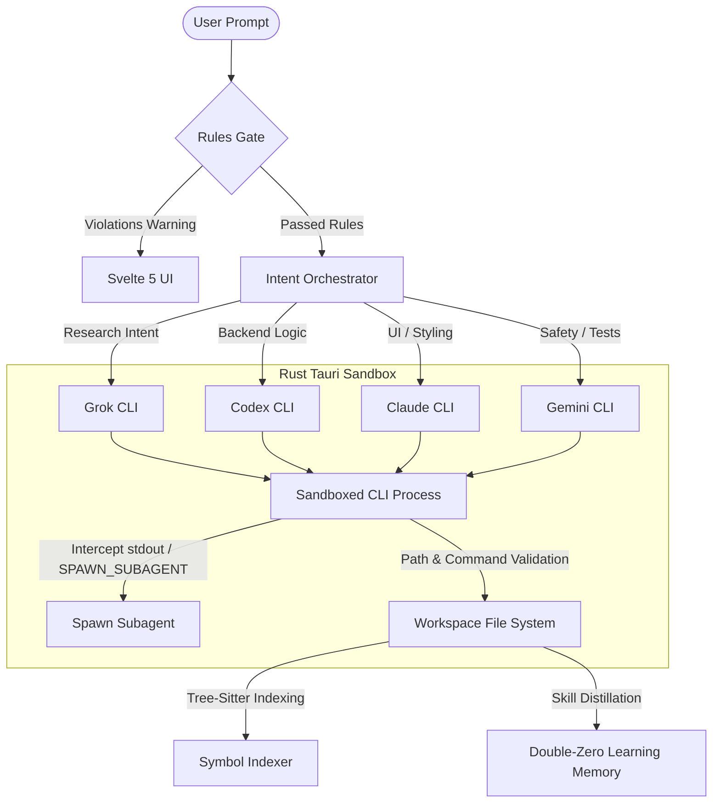

# nTropy ⚡

nTropy is a robust, state-of-the-art multi-agent orchestrator and development harness designed to lock AI capabilities inside a secure, project-bound workspace. Built with a highly responsive **Svelte 5** frontend and a performant, sandboxed **Rust + Tauri** backend, nTropy shifts the paradigm from simple single-model auto-completion to an autonomous, context-aware engineering team that respects local conventions and actively combats **AI Code Slop**.

---

## 🎯 What Makes nTropy Unique?

Most minimal harnesses (like simple shell wrappers or IDE extensions) suffer from severe limitations: they waste massive amounts of tokens by dumping entire files into the prompt (leading to **context collapse**), tie themselves to a single default model, lack safety sandboxing, and easily generate "AI slop"—thoughtless, bloated, unverified code that breaks pre-existing architectures. 

nTropy was built from the ground up to solve these architectural flaws through five core pillars:

### 1. The Double-Zero Learning Loop (DZL)
To prevent token bloat and context collapse, nTropy implements a **progressive disclosure model** for procedural skills, separating procedural knowledge into two distinct levels:
*   **Level 0 (Metadata Index):** A low-cost index of available skills, matching trigger phrases and descriptions.
*   **Level 1 (Detailed Specifications):** Detailed markdown-based action lists loaded on-demand only when a matching phrase is triggered.
*   **Autonomous Skill Distiller:** Active agents can distill successful workflows into new, reusable skill files (`.agents/skills/*.md`), enabling nTropy to programmatically learn and adapt to your codebase.

### 2. Intent-Driven Multi-Model Orchestration
No single LLM is optimal for every programming task. nTropy acts as a central mediator, automatically parsing user prompt intent and routing the execution to the specialized model/CLI chosen by the user for each section. The user gets to choose what they want to use for each section:
*   🔎 **Research & Exploration:** Guided by your model choice (defaults to **Grok**), highly optimal for codebase search, symbol lookup, and deep codebase structure analysis.
*   ⚙️ **Backend Engineering (Rust, APIs, DBs):** Routed to your model choice (defaults to **Codex**), optimized for low-level logic, performance, and API design.
*   🎨 **Frontend UI & Components (Svelte, CSS):** Handled by your model choice (defaults to **Claude**), the leading engine for visual aesthetics, layouts, and Svelte component hierarchy.
*   🛡️ **Verification & Safety Auditing:** Executed by your model choice (defaults to **Gemini**), specializing in validation tests, compiler diagnostics, and regression checks.

*Note: You can easily customize these model mappings in the UI for each section or override the orchestrator on a per-prompt basis by prefixing prompts with `@grok`, `@codex`, `@claude`, or `@gemini`.*

### 3. Dynamic Subagent Spawning
Instead of relying on a rigid, pre-configured agent hierarchy, the primary executing CLI can evaluate task complexity in real-time. By outputting a structured instruction mid-stream:
`SPAWN_SUBAGENT:name=<Name>,role=<Role>,model=<claude|gemini|grok|codex>`
The Tauri kernel intercepts the stdout chunk and instantly spins up a concurrent companion subagent, parallelizing tasks dynamically.

### 4. Anti-AI Slop "Rules Gate" (Human Code Rules v5.1)
nTropy was designed with human code rules in mind and an evergrowing and evolving rule set that stops the AI from putting out slop code. Rather than relying on external desktop files, these non-negotiable architectural standards (such as `NN-NO-UNRELATED-CHANGES` or `NN-NO-ARCHITECTURE-REWRITE`) are baked directly into the application's built-in Rules Engine. Before edits are committed, nTropy intercepts the prompt, checks the proposed changes against the baked-in ruleset, and triggers a visible Warning Gate if a violation is detected.

### 5. Secure Path and Directory Harnessing
Minimal CLI tools are vulnerable to shell injections or path traversal bugs. nTropy enforces absolute workspace locking:
*   Blocks all absolute paths or parent-directory climbing (`..`) in indexers and skills engines.
*   Converts all Windows command line execution fallbacks to structured argument slices (`std::process::Command::args`), completely neutralizing command injection vectors.

---

## 🛠️ Key Capabilities

*   **Tree-Sitter Symbol Indexer:** Parses Rust, Python, JavaScript, and TypeScript files out-of-the-box to extract structures, impl blocks, functions, methods, classes, and interfaces.
*   **Active Directory Locking:** Locks all child subprocess runs strictly within the designated workspace root directory.
*   **Multi-Chat Conversations:** Organize project-specific development threads, with isolated chat histories stored locally.
*   **Continuous Verification Scheduler:** Define periodic validation scripts (e.g., `cargo check`, `npm run test`) to execute in the background on minute, hour, or daily schedules.
*   **Real-time Process Streams:** Background Rust threads continuously capture `stdout` and `stderr` streams, delivering terminal logs to the frontend via event emitters.

---

## 📂 Architecture and How It Works

### Behind the Scenes:
1.  **Prompt Entry:** The user inputs a prompt into the Svelte UI.
2.  **Rules Verification:** The frontend calls `check_rules_action` to query Tauri's built-in `RulesEngine` to ensure the prompt doesn't violate any baked-in architectural and engineering rules.
3.  **Dynamic Routing:** The `CliMediator` parses the prompt to match keywords or model tags, selecting the target model and active directory harness.
4.  **CLI Spawning & Harnessing:** A dedicated subprocess is spawned in Rust. Standard input is written, and standard output/error is read byte-by-byte in real-time background threads to prevent UI locking.
5.  **Output Parsing & Interception:** The stdout stream is scanned line-by-line. If `SPAWN_SUBAGENT:` is captured, a Tauri event is dispatched, Svelte registers the new subagent, and it starts working.
6.  **Progressive Disclosure:** When a skill is triggered (phrase matching), the Level 0 metadata points the LLM to request the full Level 1 specification, maintaining a clean context window.

---

## 🎛️ Svelte UI Controls Explained

The nTropy visual workspace is clean, modern, and information-rich, divided into four main sections:

1.  **File Explorer & Symbol Navigator (Left Sidebar):**
    *   Lists the active project's file structure.
    *   Selecting a code file (`.rs`, `.py`, `.js`, `.ts`) triggers the **Tree-Sitter Indexer**, immediately displaying parsed structures, impl blocks, functions, and line numbers. Clicking a symbol highlights it.
2.  **Main Interactive Panel (Center):**
    *   **Chat View:** Houses active project-specific conversation threads. Shows color-coded source markers (e.g. `[ORCHESTRATOR]` routing notes, `[RULES GATE]` alerts, or stream outputs).
    *   **Tasks View:** The central panel for configuring background recurring verification cycles. Users can add a verification command, assign the model to run it, and select the cron interval (`1m`, `5m`, `30m`, `1h`, `1d`, or `once`).
3.  **Active Companion Subagents Panel (Right Panel - Tab 1):**
    *   Displays all active subagents spawned for this workspace, listing their specific roles, model engines, and cost tracking.
4.  **Double-Zero Skill Book & Active Rules Manifest (Right Panel - Tabs 2 & 3):**
    *   **Skills:** Review all distilled procedural skills saved in `.agents/skills/`. Click a skill to load the Level 1 detailed markdown specification.
    *   **Rules:** Displays the active non-negotiables baked directly inside the application, showing their severity, triggers, and active status.

---

## 🚦 What to Expect During Runtime

*   **Subtle, Premium Styling:** Built using customized dark-mode themes, rounded cards, fluid animations, and clear terminal streams.
*   **Terminal Logs:** The bottom drawer contains real-time diagnostic logs (`[STDOUT]`, `[STDERR]`) indicating what the CLI processes are executing behind the scenes.
*   **Baked-in System Rules:** The system ruleset is fully compiled and baked directly into the Tauri binary, ensuring maximum portability, security, and consistent execution across workspaces, without depending on external desktop assets.
*   **Zero Compile Errors:** nTropy is fully compiled and type-checked on both Svelte 5 and Rust backend configurations, providing a fast, warning-free native desktop container.
